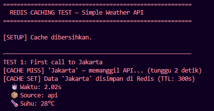
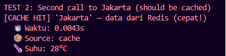
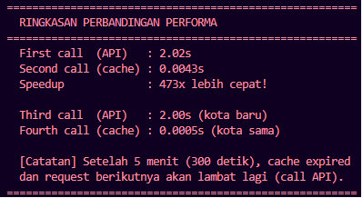

# Cache Report — Redis Caching Exercise

**Nama:** Muhammad Ibadullah
**NIM:** A11.2023.15275
**Mata Kuliah:** Pemrograman Sisi Server

---

## Kode yang Dimodifikasi

### Fungsi `get_weather()` — Before vs After

**Sebelum (tanpa cache):**

```python
def get_weather(city):
    time.sleep(2)  # Selalu 2 detik
    return {"city": city, "temp": 28}
```

**Sesudah (dengan cache):**

```python
def get_weather(city):
    cache_key = f"weather:{city.lower()}"
    cached = r.get(cache_key)           # 1. Cek cache
    if cached:
        return json.loads(cached)       # 2. Return dari cache (cepat!)
    data = _fetch_from_api(city)        # 3. Call API jika miss
    r.set(cache_key, json.dumps(data), ex=300)  # 4. Simpan ke cache
    return data
```

---

## Hasil Test

| Test   | Kota     | Kondisi          | Waktu   |
| ------ | -------- | ---------------- | ------- |
| Test 1 | Jakarta  | Cache MISS (API) | 2.02s   |
| Test 2 | Jakarta  | Cache HIT        | 0.0043s |
| Test 3 | Surabaya | Cache MISS (API) | 2.00s   |
| Test 4 | Surabaya | Cache HIT        | 0.0005s |

**Speedup:** 473x lebih cepat (dari 2.02s menjadi 0.0043s)


---

## Screenshot

Lampirkan screenshot output `test_cache.py` yang menunjukkan:

* Cache MISS pada request pertama

* Cache HIT pada request kedua

* Perbandingan waktu API dan cache

* Ringkasan speedup 473x lebih cepat


---

## Redis Commands yang Digunakan

| Command                     | Kapan Dipakai                                     |
| --------------------------- | ------------------------------------------------- |
| `r.get(key)`                | Mengecek apakah data sudah tersedia di cache      |
| `r.set(key, value, ex=300)` | Menyimpan hasil API ke Redis dengan TTL 300 detik |
| `r.ttl(key)`                | Melihat sisa waktu hidup cache                    |
| `r.delete(key)`             | Menghapus cache (invalidasi cache)                |

---

## Jawaban Pertanyaan

### Kenapa response time berbeda?

Response pertama membutuhkan waktu sekitar 2 detik karena aplikasi harus mengambil data dari sumber asli (disimulasikan menggunakan `time.sleep(2)`). Setelah data disimpan di Redis, request berikutnya tidak perlu mengakses sumber data lagi dan cukup mengambil data langsung dari memori Redis sehingga waktu respons turun menjadi beberapa milidetik.

### Apa keuntungan caching?

1. **Meningkatkan performa aplikasi** karena data dapat diambil jauh lebih cepat dari memori.
2. **Mengurangi jumlah request ke API eksternal** sehingga menghemat bandwidth dan resource.
3. **Mengurangi beban server** karena data yang sering diakses tidak perlu diproses berulang kali.
4. **Meningkatkan pengalaman pengguna** dengan waktu respons yang lebih cepat.

### Kapan sebaiknya tidak menggunakan cache?

1. Data yang berubah sangat cepat, misalnya harga saham atau kurs mata uang real-time.
2. Data yang harus selalu akurat dan terbaru, seperti saldo rekening atau transaksi keuangan.
3. Data yang bersifat sensitif dan berbeda untuk setiap pengguna.
4. Operasi penulisan data (INSERT, UPDATE, DELETE) karena cache lebih efektif untuk mempercepat pembacaan data (read operation).
